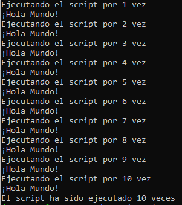

En esta práctica inicial comenzamos nuestro recorrido en el mundo de las operaciones de aprendizaje automático (MLOps). Antes de adentrarnos en los conceptos fundamentales, es crucial asegurarnos de que todos cuenten con una base sólida en ciertos temas esenciales que utilizaremos a lo largo del curso.

Nos enfocaremos en repasar el uso de la línea de comandos, una herramienta clave para la configuración de un entorno de desarrollo adecuado. Este entorno será fundamental para acompañarlos durante todo el proceso de aprendizaje y aplicación de MLOps.

## 🎯 Objetivo

Esta práctica tiene como objetivo familiarizarse con el uso de la línea de comandos como herramienta esencial en proyectos de MLOps.

## ¿Qué es la línea de comandos?
La línea de comandos, o terminal, no es un concepto arcaico, sino una herramienta fundamental que precede a las interfaces gráficas. Es ampliamente utilizada en Linux, aunque en Mac y Windows suele pasarse por alto. En MLOps, muchas herramientas carecen de interfaz gráfica, por lo que dominar la terminal mejora el flujo de trabajo y es esencial, especialmente cuando trabajemos en la nube más adelante.

## Instalación de WSL (Subsistema de Windows para Linux)
Si no usas Linux, debes instalar WSL para tener este sistema operativo en tu máquina Windows. En la [sección prerequistos de la guía oficial de instalación de WSL](https://learn.microsoft.com/en-us/windows/wsl/install) puedes verificar que tu sistema cumple con los requisitos necesarios.  Si ya usas Linux como sistema operativo puedes omitir esta sección.

WSL puede instalarse principalmente de dos formas, dependiendo de la versión y número de compilación del sistema operativo Windows que tengas instalado en tu máquina.

- **Compilaciones recientes de Windows**.
    En la seccion [Get Started](https://learn.microsoft.com/en-us/windows/wsl/setup/environment) del documento que guía en el proceso de configuración de un entorno de desarrollo WSL, puedes revisar los requistos para usar la versión simplificada de instalación usando el comando `wsl --install` desde la terminal de Windows (PowerShell o CMD).

    Si cumples los requisitos, te recomendamos sigas la [guia de instalación](https://learn.microsoft.com/en-us/windows/wsl/install) pero **cambies la distribución por omisión, de Ubuntu a Ubuntu 24.04.1 LTS**. En la sección [Change the default Linux distribution installed](https://learn.microsoft.com/en-us/windows/wsl/install), del mismo documento oficial podras encontrar como hacerlo.

- **Compilaciones antiguas de Windows**.
    Si tu compilacion de Windows no cumple los requisitos indicados en el punto previo, te recomendamos sigas la guia de instalación manual descrita en este [documento](https://learn.microsoft.com/en-us/windows/wsl/install-manual?source=recommendations). Al final del proceso, recuerde escoger la **distribución Ubuntu 24.04.1 LTS** como opción a instalar.
    
    
Una vez que haya instalado la distribución de Ubuntu seleccionada, tendrá que crear una **cuenta de usuario** y **una contraseña** para acceder a esta distribución de Linux. Toma en cuenta, que WSL(Linux) y Windows son dos sistemas separados, por tanto, al instalar paquetes (como pip) en Linux no los instala automáticamente en Windows. Debes instalarlos en cada sistema por separado si los necesitas en ambos. Sin embargo, el resto de las practicas **usarán Linux por defecto por lo que no es necesario instalar paquetes en ambos sistemas operativos**.

### Verificación de la versión WSL instalada

Es **importante verificar que este usando la versión WSL 2** pues esta versión ofrece una serie de mejoras clave frente a WSL 1 que lo hacen necesario o altamente recomendable para la mayoría de los casos de uso actuales, especialmente en entornos de desarrollo, ciencia de datos, y prácticas que requieren compatibilidad real con Linux.

¿Cómo verificar la versión de WSL y la distribución instalada?

Ejecuta:
```bash 
wsl -l -v
```

Esto mostrará la lista de distribuciones instaladas y la versión de WSL que están utilizando. Por ejemplo:
```bash 
NAME      STATE           VERSION
Ubuntu    Running         1
```
Si el resultado es el mismo que en el ejemplo, significa que **no se ha utilizado la opción correcta de instalación**, acorde con la compilación de tu sistema Windows


### Problemas en la instalación
En algunos casos, el proceso de instalación puede no completarse correctamente. En estas situaciones, te recomendamos consultar los [problemas y soluciones proporcionados por Microsoft](https://learn.microsoft.com/en-us/windows/wsl/troubleshooting?source=recommendations).


## Uso de la terminal 

!!! warning "Importante"
    Si no está familiarizado con Linux vale la pena revisar un resumen con los [principales comandos](recursos/command_line_cheatsheet.pdf) que se pueden ejecutar en la terminal.

Familiarizarse con los comandos básicos de la terminal `which`, `echo`, `cat`, `wget`, `less`, y `top` y el operador de redirección de salida `>`. Responde las preguntas en la plataforma virtual

- Abre una terminal (en la distribución de Linux que estes usando)

- Actualiza la lista de paquetes y sus versiones en el sistema utilizando los siguientes comandos. Esta acción es especialmente importante si acabas de instalar WSL, pues este sistema intenta ser liviano y rápido y no fuerza actualizaciones automáticas.

    ```bash 
    sudo apt update
    sudo apt upgrade 
    ```

- Instala también `pip` (el gestor de paquetes de Python).
    ```bash
    sudo apt install python3-pip.
    ```

- Verifica la instalación escribiendo `pip3 --version`.

- Crea una carpeta principal denominada `Practicas-MLOPS` para almacenar todas las prácticas del curso. Dentro de esta carpeta, crea una subcarpeta llamada `Practica-1` y **ubícate dentro de ella para realizar el trabajo correspondiente**.
  
- Es importante saber editar archivos desde la terminal. La mayoría de los sistemas tiene instalado el editor `nano`; si no, identifica cuál está disponible.

    - Escribe `nano` en la terminal.
    - Escribe el siguiente texto en el script:
    
        ```python
        if __name__ == "__main__":
            print("Hola mundo!")
        ```    
    
    - Guarda el script como `.py`, ejecútalo con `python3 <nombre_archivo>.py`.
    - Edita el archivo desde la terminal para cambiar el mensaje.

- Todas las terminales vienen con un lenguaje de programación. El sistema más común se llama `bash`, y saber escribir programas simples en bash puede ser muy útil. Por ejemplo, para ejecutar varios programas de Python de manera secuencial, puedes hacerlo mediante un script en bash.

    - Escribe un script en bash (usando `nano`) y grábalo como `mi_script.sh`:

        ```bash
        #!/bin/bash
        # Un script de ejemplo en bash
        echo "¡Hola Mundo!"
        ```
    
    - Averigua como ejecutarlo. Responde las preguntas en la plataforma virtual
    - Modifica el script `mi_script.sh` para llamar al programa Python que escribiste. Responde la pregunta en la plataforma virtual
    - Escribe un nuevo script (usando `nano`) y grábalo como `ciclo.sh`. El script debe implementar un bucle for que ejecute el script (`mi_script.sh`) 10 veces seguidas. Responda la pregunta en la plataforma virtual.
    - Ejecuta el nuevo script. La salida debe mostrase así:

        

- Un truco que se va a necesitar a lo largo de este curso es establecer variables de entorno. Una variable de entorno es simplemente un valor con nombre dinámico que puede alterar el comportamiento de los procesos en ejecución en una computadora. La sintaxis para establecer una variable de entorno depende del sistema operativo.
    - Establecer una variable de entorno e imprimirla.

        ```bash
        export VARIABLE=hola
        echo $VARIABLE
        ```
    
    - Para usar una variable de entorno en un programa Python, puedes usar la función `os.environ` del módulo `os`. Escriba un programa Python (`programa.py`) que imprima la variable de entorno que acaba de establecer. Responda pregunta en la plataforma virtual.
    - <a id="mi-ancla"></a>Si tiene una colección de variables de entorno, éstas pueden almacenarse en un archivo `.env`. El archivo denominado, por ejemplo, `ventorno.env` debería tener el siguiente formato:

        ```bash
        VARIABLE_1=Hola
        VARIABLE_2=Mundo
        ```

- Para cargar las variables de entorno desde el archivo, puede utilizar el paquete `python-dotenv`. Puedes instalarlo usando `pip3 install python-dotenv` y luego intenta cargar las variables de entorno desde el archivo e imprimirlas. Crea el siguiente archivo en python que lea una de las variables del archivo `ventorno.env`.

    ```python
    import os
    from dotenv import load_dotenv
    load_dotenv(‘path_to_file_env’)
    print(os.environ["VARIABLE_1"])
    ```

    Responde en la plataforma virtual porqué no fue posible instalar el modulo `python-dotenv`.

!!! note "Información"
    La explicación sobre el problema de instalación del modulo `python-dotenv` lo abordaremos en el próximo tema.
