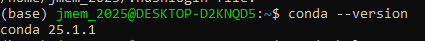

En esta práctica continuamos nuestro recorrido por el mundo de las operaciones de aprendizaje automático (MLOps). Antes de avanzar hacia procesos más complejos, es esencial contar con las herramientas adecuadas para instalar, actualizar y gestionar las dependencias de nuestros proyectos.

Nos enfocaremos en el uso de gestores de paquetes como `conda` y `pip`, que nos permitirán construir entornos reproducibles, mantener versiones compatibles de librerías y facilitar la colaboración entre equipos. Estas habilidades serán clave para desarrollar proyectos robustos y eficientes a lo largo del curso de MLOps.

## 🎯 Objetivo

Esta práctica tiene como objetivo familiarizarse con el uso de gestores de paquetes para instalar, gestionar y documentar dependencias en proyectos de MLOps, asegurando entornos consistentes y controlados para el desarrollo y despliegue de modelos.

## Instalación de Conda o Miniconda

- Descargue e instala `conda` o `miniconda`. `Conda` incluye muchos paquetes, mientras que `miniconda` es más ligera. Para los fines del curso se puede instalar `miniconda`.  Las instrucciones para la instalación de Miniconda se encuentran en: [https://www.anaconda.com/docs/getting-started/miniconda/install](https://www.anaconda.com/docs/getting-started/miniconda/install). 

    !!! note "Observación-1"
        Recuerde leer las instrucciones para Linux desde la terminal (*Linux terminal installer*).

    !!! note "Observación-2" 
        Cuando se le pregunte si desea modificar la configuración del shell para inicializar conda cada vez que abras un nuevo shell y para reconocer los comandos de conda automáticamente, responda **YES**.

- Verifica la instalación. Si no funciona, puede ser necesario configurar la variable de entorno correspondiente. Si se ha instalado con éxito `miniconda`, entonces deberías ser capaz de ejecutar el comando `conda --version` en la terminal.

    

    Conda siempre indicara en que entorno estás actualmente, indicado por (`env_name`) en el prompt. Por defecto, siempre se iniciará en el entorno (`base`).

## Creación de entornos virtuales

- Dentro del directorio principal denominada `Practicas-MLOPS` crea un subdirectorio `Practica-2` para alojar los ejercicios correspondientes a este tema.

Las preguntas de las siguientes tareas responder en la plataforma virtual. Si no esta familiarizado con `conda` puede revisar [información de los comandos principales](recursos/conda_cheatsheet.pdf).

- Crear un nuevo entorno virtual. Asegúrarse de que se llama `mi_entorno` y que instala la versión 3.11 de Python. 

    - ¿Qué comando deberías ejecutar para hacer esto?
    - ¿Qué comando de conda da una lista de todos los entornos creados?
    - ¿Qué comando de conda se puede usar para activar el entorno creado?
    - ¿Qué comando de conda da una lista de los paquetes instalados en el entorno actual?

- Pruebe de instalar el paquete `dotenv` dentro del entorno. Lo recomendable es instalar el paquete usando `conda`, sin embargo, es bastante seguro usar `pip` dentro de conda hoy en día. **Use `pip` esta vez**, y una vez instale el paquete cree un archivo de Python `programa_entorno.py` para cargar las variables de entorno desde el archivo `ventorno.env`. **__!! Recuerda la última tarea de la [práctica previa](p1.md#mi-ancla) !!__**.

- Verifica que el archivo de Python `programa_entorno.py` imprime una de las variables del archivo `ventorno.env`.

- ¿Cómo exportar fácilmente la lista de paquetes instalados en el entorno a un archivo de texto? Asegúrate de exportarlo a un archivo llamado `environment.yaml`, ya que conda usa otro formato por defecto que pip.

- Inspeccione el archivo para ver qué contiene. El archivo `environment.yaml` que has creado es una forma de **asegurar la reproducibilidad entre usuarios** porque cualquiera debería ser capaz de obtener una copia exacta de tu entorno si tiene tu archivo `environment.yaml`. 

- ¿El paquete `dotenv` recientemente instalado en el entorno `conda` forma parte de la lista?. ¿Porqué no está en la lista si fuese el caso? Puedes crear un archivo `environment1.yaml` que contenga también el paquete `dotenv`.

- Intente crear un nuevo entorno (`mi_entorno_copia`) directamente desde su archivo `environment.yaml` y compruebe que los paquetes que se instalan coinciden exactamente con los que tenía originalmente.

- ¿Cuál es el comando pip correspondiente que da una lista de todos los paquetes `pip` instalados? ¿Y cómo exportar esto a un archivo `requirements.txt`?

- Si echas un vistazo a los requisitos que tanto `pip` como `conda` producen, verás que a menudo están llenos de muchos más paquetes de los que estás usando en tu proyecto. Lo que te interesa son los paquetes que importas en tu código: `from package import module`. Una forma de evitar esto es usar el paquete `pipreqs`, que automáticamente escaneará tu proyecto y creará un archivo de requisitos específico para él.  

- Luego de instalar `pipreqs` en el **entorno de copia**, pruebe este paquete sobre el código de los archivos de Python de la carpeta en la Practica-1.

- ¿Qué aspecto tiene el archivo `requirements.txt` que produce `pipreqs` comparado con los archivos producidos por `pip` o `conda`?

!!! note "Importante"
    Si bien los métodos mencionados en los ejercicios son excelentes maneras de construir archivos de requisitos automáticamente, a veces es más fácil sentarse y crear manualmente los archivos, ya que de esa manera te aseguras de que sólo se instalen los requisitos más necesarios al crear un nuevo entorno.
