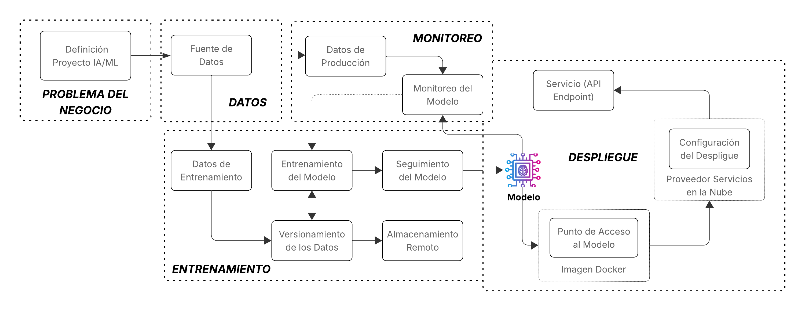

La siguiente arquitectura es la base de las prácticas del curso de MLOps de la Maestría en Ciencia de Datos, y permite estructurar de manera clara y ordenada cada etapa del ciclo de vida de un proyecto de aprendizaje automático. Desde la comprensión del problema de negocio y la preparación de los datos, hasta el entrenamiento, despliegue, monitoreo y mejora continua del modelo, esta arquitectura permite aplicar los principios de MLOps de forma progresiva. Cada componente de este flujo guía a los estudiantes en el uso de herramientas específicas para automatizar procesos, garantizar la reproducibilidad y facilitar la integración de modelos en entornos reales. La representación visual de esta arquitectura sirve como referencia central para entender cómo se conectan y orquestan todos los elementos del proyecto.

## Estructura práctica del curso basada en la arquitectura

A continuación, se detalla la relación entre las prácticas propuestas y la arquitectura presentada. 

- Las tres primeras prácticas ([Linea de Comandos](../ambiente/p1.md), 
    [Gestión de Paquetes y Entornos Virtuales](../ambiente/p2.md) y [Editor](../ambiente/p3.md) están orientadas a que los estudiantes comprendan los conceptos fundamentales y se familiaricen con las herramientas necesarias para la creación de un entorno de desarrollo adecuado, que servirá como base para el resto del ciclo de vida del proyecto de aprendizaje automático. 

- **Problema del Negocio**. En la práctica [Alineación Estratégica del Proyecto](../negocio/p4.md), se utilizarán las herramientas **AI Canvas** y/o **ML Canvas** con el objetivo de alinear los objetivos del proyecto con una necesidad concreta del negocio, comprender mejor el contexto del problema y analizar los datos disponibles para su desarrollo.

    Además, como parte de la preparación inicial, se ejecutarán tareas clave de **configuración del proyecto**, incluyendo:

    - La [creación del entorno virtual](../entorno/p5.md) utilizando `Conda`, lo que permitirá una gestión adecuada de las dependencias del proyecto, y

    - La definición de la [estructura del proyecto](../entorno/p6.md) mediante `Cookiecutter`, siguiendo buenas prácticas de organización del código y recursos en proyectos de machine learning.
    
- **Datos**. Para este proyecto de predicción, se utiliza el conjunto de datos [Supply Chain Shipment Pricing Data](https://www.kaggle.com/datasets/divyeshardeshana/supply-chain-shipment-pricing-data), que contiene información detallada sobre envíos de mercancías. Este dataset es especialmente útil para tareas de modelado predictivo relacionadas con el cálculo o estimación de costos logísticos.

    Algunas de la variables incluidas en este conjunto de datos son:

    - Tipo de envío: define la modalidad del envío (por ejemplo, urgente, regular).
    - Origen y destino: indica las ubicaciones geográficas involucradas en el transporte.
    - Peso y volumen del envío: características físicas relevantes para el cálculo de tarifas y la logística.
    - Fecha y hora del envío: permiten explorar aspectos temporales como estacionalidad o plazos de entrega.
    - Método de transporte: medio utilizado (aéreo, marítimo, terrestre, etc.).
    - Costos asociados: variable objetivo que se desea predecir, relacionada con el precio final del envío.

    Este conjunto de datos es el insumo clave para el desarrollo del modelo que permite automatizar la estimación de costos y optimizar procesos dentro de la cadena de suministro. En la práctica [Versionado del Código](../entrenamiento/p7.md), se implementan los scripts necesarios para cargar y preparar esta fuente de datos durante el proceso de entrenamiento del modelo.

- **Entrenamiento**. El proceso de entrenamiento en un flujo MLOps, abarca desde la recopilación y preparación de los datos hasta la generación de un modelo listo para producción. En el contexto del curso de MLOps, este proceso se fortalece mediante la aplicación de prácticas esenciales que aseguran reproducibilidad, trazabilidad y escalabilidad.

    Durante la práctica de [Versionado del Código](../entrenamiento/p7.md), se establecen mecanismos para registrar cambios en los scripts de entrenamiento, facilitando la colaboración y el control de modificaciones. Con [Empaquetado y gestión de dependencias](../entrenamiento/p8.md), se garantiza que los entornos sean reproducibles y portables, lo cual es clave para ejecutar el entrenamiento en distintos entornos sin errores.

    La práctica de [Buenas Prácticas de Codificación](../entrenamiento/p9.md) mejora la legibilidad, mantenibilidad y robustez del código usado en la ingesta, preprocesamiento y entrenamiento. Por otro lado, [Almacenamiento remoto con DVC](../versionado_datos/p10.md) y [Control de versiones de datos](../versionado_datos/p11.md) permiten manejar datasets grandes de forma eficiente y controlada, asegurando que se pueda reproducir exactamente cualquier experimento.

    Con [Trabajando con Pipelines](../versionado_datos/p12.md), se estructuran las etapas del flujo de datos y entrenamiento como tareas modulares, lo que facilita la automatización y escalabilidad del proceso. Finalmente, el [Control de Versiones del Modelo](../versionado_modelo/p13.md) permite registrar cada versión entrenada con sus métricas y configuración, lo que es vital para hacer seguimiento y decidir qué modelo es apto para desplegar.

    Estas prácticas integradas fortalecen cada paso del entrenamiento, desde los datos hasta el modelo final, asegurando un flujo de trabajo robusto y alineado con los principios de MLOps.

- **Despliegue**. La fase de Despliegue representa el proceso de poner el modelo entrenado en producción para que pueda ser consumido por aplicaciones o usuarios finales. Esta etapa incluye:

    - Punto de Acceso al Modelo: el modelo se expone a través de un servicio, usualmente como una API, facilitando su integración en sistemas reales.

    - Imagen Docker: el modelo, junto con su entorno y dependencias, se empaqueta en un contenedor, asegurando portabilidad y consistencia en distintos entornos.

    - Configuración del Despliegue y Proveedor de Servicios en la Nube: se define la infraestructura en la nube donde se alojará el modelo, permitiendo escalar y monitorear el servicio.

    - Servicio (API Endpoint): es el punto final donde se reciben solicitudes y se devuelven predicciones, habilitando el uso práctico del modelo en tiempo real.

    Esta fase es clave para cerrar el ciclo del flujo MLOps y conectar el modelo con el mundo real.

- **Monitoreo**. Esta fase se encarga de supervisar el comportamiento del modelo una vez desplegado. Esta incluye:

    - Monitoreo del Modelo: permite detectar desviaciones en el rendimiento del modelo (por ejemplo, por cambios en los datos de entrada), lo que puede indicar necesidad de reentrenamiento.

    - Seguimiento del Modelo: registra métricas clave, como precisión, latencia o tasa de error, a lo largo del tiempo para asegurar que el modelo sigue cumpliendo con los objetivos del negocio.

    Esta etapa es fundamental para mantener la calidad y confiabilidad del sistema de IA/ML en producción.