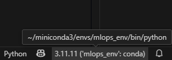

Una tarea basica en el flujo de trabajo MLOps es la creación de un **entorno virtual**, incluso antes de establecer la estructura base del proyecto. Este paso es fundamental para asegurar un entorno aislado y reproducible desde el inicio.
Este entorno permite aislar las dependencias del proyecto y evitar conflictos con otras configuraciones del sistema. Usaremos **Conda**, un gestor de entornos ampliamente adoptado en la ciencia de datos, por su capacidad para manejar tanto paquetes de Python como binarios del sistema.

Crear un entorno virtual no solo mejora la organización y portabilidad del proyecto, sino que también garantiza que todos los colaboradores trabajen bajo las mismas condiciones, lo cual es clave para la **reproducibilidad**, la **consistencia** y el **despliegue confiable** de modelos.

## 🎯 Objetivo

Configurar un entorno virtual utilizando Conda para gestionar las dependencias del proyecto de forma controlada, asegurando un desarrollo reproducible y colaborativo.

## Crear y activar entorno del proyecto
Trabajar dentro de un entorno virtual asegura que el proyecto utilice únicamente las versiones específicas de las librerías requeridas, evitando conflictos con otras configuraciones del sistema. Esto resulta especialmente crucial en contextos colaborativos, ya que permite que todos los miembros del equipo trabajen bajo las mismas condiciones, lo que facilita tanto la reproducibilidad del proyecto como su mantenimiento.

Responde las preguntas a estas taraes en la Plataforma Virtual:

1. Abrir una terminal (o una terminal de WSL si estás trabajando Linux remotamente sobre Windows).
2. Suponga que el proyecto estará alojado dentro de la carpeta `Práctica-5`, la cual es parte del directorio principal `Practicas-MLOPS`. 
3. Crear el entorno virtual, usando la siguiente información:

    ```bash
    nombre entorno: mlops_env
    versión Pythton: 3.11
    ```

4. Activa el entorno creado
5. Verifica que el entorno está activo, observando que su nombre aparece al inicio de la línea de comandos.
6. A partir de este momento, **todas las librerías necesarias para el proyecto deberán instalarse dentro de este entorno** usando `conda install` o `pip install`.


### 🛠️ Tarea
Como parte de los requerimientos del proyecto, necesitas crear un archivo de Python llamado `estadisticas.py`. Este archivo debe utilizar la biblioteca `pandas` para construir un pequeño DataFrame con datos de ejemplo y mostrar estadísticas descriptivas básicas.

Para facilitar la implementación se usará VS Code

1. Abre VS Code y asegúrate de estar trabajando dentro de la carpeta `Practica-5`.
2. Abre la terminal integrada en VS Code (Ctrl + o Ver > Terminal), y activa el entorno de conda creado previamente.
3. Instala la biblioteca `pandas` version=1.5.3 en el entorno virtual.
4. Verifica que el entorno tiene instalada la biblioteca `pandas`
5. Crea el archivo `estadisticas.py` dentro de la carpeta actual.
6. Escribe el siguiente código en `estadisticas.py`:

    ```python
    import pandas as pd

    # Crear un DataFrame con datos de ejemplo
    datos = {
        'Nombre': ['Ana', 'Luis', 'Carlos', 'Marta'],
        'Edad': [23, 35, 29, 42],
        'Ingresos': [2500, 4000, 3200, 5000]
    }

    df = pd.DataFrame(datos)

    # Mostrar el DataFrame
    print("Datos del DataFrame:")
    print(df)

    # Mostrar estadísticas descriptivas
    print("\nEstadísticas básicas:")
    print(df.describe())

    # Edad promedio
    print(f"\nEdad promedio: {df['Edad'].mean():.2f} años")
    ```

7. Antes de ejecutar no se olvide de seleccionar el interprete `mlops_env` que contiene todas las librerias necesarias. En la barra inferior izquierda de VS Code, localiza la sección que indica el intérprete actual de Python.

    

## Cómo compartir el entorno con Conda

En un proyecto colaborativo, es fundamental que todos los miembros trabajen en un entorno de desarrollo idéntico. Para lograrlo, se utiliza un archivo `environment.yml`, que documenta la configuración exacta del entorno Conda (incluyendo Python y todas las librerías instaladas). Este archivo facilita la reproducción del entorno en diferentes equipos y evita errores por incompatibilidades.

> 📝 Esta explicación fue introducida en la práctica [Ambiente de Desarrollo / Gestor de Paquetes](../ambiente/p2.md).

#### 🛠️ Tarea
Como líder del proyecto, una vez que has finalizado la implementación y verificado que todo funciona correctamente, es momento de compartir el entorno de Conda con el resto del equipo. Para ello, debes exportar el entorno a un archivo `environment.yml`. Este archivo permitirá que tus compañeros puedan reproducir las mismas condiciones de trabajo en sus propias máquinas y continuar con el desarrollo sin contratiempos.

- ¿Qué comando usarías para generar este archivo?
- Si revisas el archivo `environment.yml`, verás que contiene muchos paquetes, pero en este ejercicio solo hemos instalado dos de forma explícita:

    - python=3.11 al momento de configurar el entorno.
    - pandas=1.5.3 para implementar las estadísticas del proyecto.

    ¿Qué comando usar para exportar únicamente los paquetes que instalaste directamente? (y no todas las dependencias internas que Conda añadió automáticamente).

> 📝 Una vez que el archivo `environment.yml` ha sido creado y compartido, cada colaborador debe clonar el repositorio del proyecto (este proceso se detalla en la práctica: [Versionado de Código](../entrenamiento/p7.md)), ubicarse en la raíz del proyecto y ejecutar el siguiente comando para recrear el entorno Conda de forma idéntica:
> ```bash 
> conda env create -f environment.yml
> ```
>Esto crea un nuevo entorno con el mismo nombre y configuración que el original.
>
>💡 Consejo: Si deseas usar un nombre distinto para el entorno, puedes usar:
>```bash
> conda env create -f environment.yml -n >nombre_personalizado
>```
>
>Una vez creado el entorno, actívalo con:
> ```bash 
> conda activate nombre_entorno
> ```
> Así, todos los integrantes del equipo estarán trabajando en condiciones idénticas.


