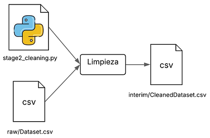
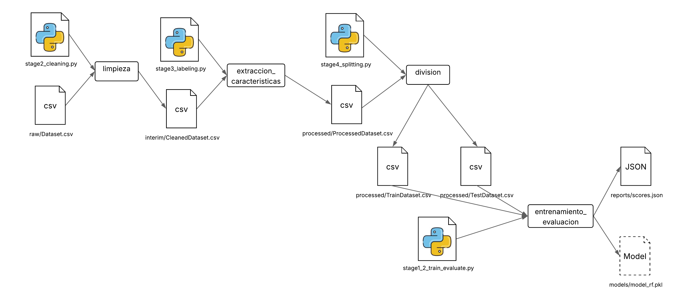

Después de configurar el almacenamiento remoto y configurar el inicio de un proyecto DVC para versionar datos y modelos, el siguiente paso es automatizar y estructurar flujos de trabajo mediante la construcción de un pipeline de experimentos. Un pipeline permite encadenar etapas del proceso (por ejemplo, preprocesamiento, entrenamiento y evaluación) de forma reproducible y trazable, facilitando el trabajo colaborativo y la experimentación sistemática.

Esta práctica está basada en el conjunto de datos previamente versionado con DVC (`data/raw/Dataset.csv`). Este archivo es la fuente de datos para entrenar el modelo de predicción. Recordemos que el proyecto implementado tiene tres etapas principales:

- Preprocesamiento de datos (limpieza, extracción de características, y división de datos)
- Entrenamiento del modelo
- Evaluación del modelo

## 🎯 Objetivos

- Construir un pipeline de ML utilizando DVC.
- Declarar las dependencias y salidas de cada etapa del flujo de trabajo.
- Ejecutar y rastrear automáticamente los cambios en los datos o en el código que afecten el resultado del experimento.
- Comprender cómo DVC administra los archivos intermedios y el modelo final en cada etapa.

## 🛠️ Requisitos

Debes contar con los siguientes scripts organizados en tu proyecto:

- **stage2_cleaning.py**: Realiza la limpieza y preprocesamiento de los datos brutos, eliminando valores inconsistentes o faltantes y estandarizando formatos para su posterior análisis.

- **stage3_labeling.py**: Extrae características relevantes desde la fuente de datos y asigna etiquetas necesarias para el entrenamiento supervisado del modelo.

- **stage4_splitting.py**: Divide el conjunto de datos procesado en subconjuntos de entrenamiento y prueba, asegurando una distribución adecuada para la validación del modelo.

- **stage1_2_train_evaluate.py**: Entrena el modelo utilizando el conjunto de entrenamiento y evalúa su desempeño sobre el conjunto de prueba, generando métricas de rendimiento clave.

!!! warning "Advertencia:"
    Los pipelines propuestos a continuación están basados en la estructura del repositorio (creado en la práctica [Estructura del Proyecto](../entorno/p5.md) y especializado en las prácticas [Versionado del Código](../entrenamiento/p7.md), [Empaquetado y gestión de dependencias](../entrenamiento/p8.md) y [Buenas prácticas de codificación](../entrenamiento/p9.md)). Sin embargo, es posible crear otros scripts y crear pipelines específicos para las necesidades de su proyecto.


## Creación de pipelines
DVC construye un pipeline basado en tres componentes: Entradas (Inputs), Salidas (Outputs) y Comando (Command). Por ejemplo, para la etapa de limpieza de datos, estos serían los componentes:

- **Entradas**: archivo `data/raw/Dataset.csv` y el script `stage2_cleaning.py`
- **Salidas**: archivo `data/interim/Cleaned_Dataset.csv`
- **Comando**: `python3 stage2_cleaning.py`

Para crear esta etapa, utilizamos el comando `dvc stage add` de la siguiente forma:

```bash
dvc stage add -n limpieza \
  -d src/data_eng/stage2_cleaning.py -d data/raw/Dataset.csv \
  -o data/interim/Cleaned_Dataset.csv \
  python3 src/data_eng/stage2_cleaning.py
```

Aquí nombramos esta etapa como "limpieza" usando la opción `-n`. También definimos las entradas con la opción `-d` y las salidas con la opción `-o`. El comando que se ejecuta siempre va al final del comando `dvc stage add`, sin ninguna opción.

!!! warning "Consejo"
    Los archivos de salida se agregan al control de DVC cuando reproduces una etapa de DVC. Cuando finalices tu experimento, recuerda usar dvc push para versionar no solo los datos usados sino también los resultados generados durante el experimento.

En este punto, es posible que hayas notado que se creo un nuevo archivo: `dvc.yaml`. Este archivo es responsable de guardar lo que se describió en cada comando `dvc stage add`. Por lo tanto, si deseas crear o modificar una etapa específica, es posible editar directamente el archivo `dvc.yaml`. El archivo actual se vería así:

```bash
stages:
  limpieza:
    cmd: python3 src/data_eng/stage2_cleaning.py
    deps:
    - src/data_eng/stage2_cleaning.py
    - data/raw/Dataset.csv
    outs:
    - data/interim/Cleaned_Dataset.csv
```

El pipeline actual se ve así:



### Probar la primera etapa
Una vez que se ha creado una etapa del pipeline usando `dvc stage add`, ya es posible probar la ejecución del pipeline utilizando el comando:

```bash
dvd repro
```
Por ahora, el pipeline cuenta únicamente con una etapa llamada `limpieza`, la cual se encarga del preprocesamiento inicial de los datos. Sin embargo, más adelante se integrarán otras fases como extracción de características, division de datos, entrenamiento y evaluación del modelo.

#### ¿Qué hace dvc repro?
- Ejecuta las etapas necesarias del pipeline en el orden definido por sus dependencias.
- Reproduce etapas automáticamente solo si detecta que alguna dependencia ha cambiado (por ejemplo, si se modificó un archivo de entrada o un parámetro).
- Encadena etapas si hay varias definidas y conectadas entre sí.

Cada vez que se ejecuta `dvc repro`, DVC genera o actualiza el archivo `dvc.lock`. Este también es un archivo YAML y su función es similar a los archivos `.dvc`. En su interior, podemos encontrar la ruta y un código hash para cada archivo de cada etapa, lo que permite a DVC hacer seguimiento de los cambios. Este seguimiento es importante porque ahora DVC puede saber cuándo una etapa debe ejecutarse de nuevo o no, basándose en si sus dependencias cambiaron.

🛠️ Tarea

La primera vez que ejecutaste `dvc repro`, se ejecutó por completo la etapa de limpieza, generando los archivos de salida correspondientes.

- ¿Qué ocurre si vuelves a ejecutar `dvc repro` sin realizar ningún cambio en los datos, parámetros o código?. Responde la pregunta en la plataforma virtual.

### Actualización de las demás etapas del pipeline

A partir de este punto, puedes definir y actualizar las siguientes etapas del pipeline directamente en el archivo `dvc.yaml`. Cada tarea o paso del flujo de trabajo se especifica como una etapa (stage) dentro de dicho archivo, siguiendo la estructura del pipeline. Por ejemplo:

```yaml
stages:
  limpieza:
    cmd: python3 src/data_eng/stage2_cleaning.py
    deps:
    - data/raw/Dataset.csv
    - src/data_eng/stage2_cleaning.py
    outs:
    - data/interim/Cleaned_Dataset.csv

  extraccion_caracteristicas:
    cmd: python3 src/data_eng/stage3_labeling.py
    deps:
    - data/interim/Cleaned_Dataset.csv
    - src/data_eng/stage3_labeling.py
    outs:
    - data/processed/Processed_Dataset.csv

  division:
    cmd: python3 src/data_eng/stage4_splitting.py
    deps:
    - data/processed/Processed_Dataset.csv
    - src/data_eng/stage4_splitting.py
    outs:
    - data/processed/Train_Dataset.csv
    - data/processed/Test_Dataset.csv

  entrenamiento_evaluacion:
    cmd: python3 src/model_eng/stage1_2_train_evaluate.py
    deps:
    - data/processed/Test_Dataset.csv
    - data/processed/Train_Dataset.csv
    - src/model_eng/stage1_2_train_evaluate.py
    params:
      - configs/model_eng.yaml:
        - RandomizedSearchCV.scoring
        - RandomizedSearchCV.n_iter
    outs:
    - models/model_rf.pkl
    metrics:
    - reports/scores.json
```

El pipeline que representa el proyecto quedaría así:



Entre las etapas definidas en el archivo `dvc.yaml`, a continuación se describe en detalle la etapa **entrenamiento_evaluacion**:

Esta etapa forma parte del pipeline de DVC y tiene como objetivo entrenar y evaluar el modelo de aprendizaje automático utilizando conjuntos de datos previamente procesados:

- `entrenamiento_evaluacion`: es el indentificador de la etapa.
- `cmd: python3 src/model_eng/stage1_2_train_evaluate.py`: Este es el script que se ejecuta cuando se corre esta etapa. En este caso, se trata de un script en Python que:

    - Entrena el modelo y evalúa su desempeño.
    - Guarda el modelo entrenado y las métricas.

- `deps`:
    - `data/processed/Test_Dataset.csv`
    - `data/processed/Train_Dataset.csv`
    - `src/model_eng/stage1_2_train_evaluate.py`

      Estas son las entradas que DVC monitorea para saber si el stage debe volver a ejecutarse. Si alguno de estos archivos cambia, DVC vuelve a ejecutar el stage. Aquí se incluyen:

      - Los datos de entrenamiento y prueba procesados.
      - El script de entrenamiento/evaluación.

- `params:`
    - `configs/model_eng.yaml:`
      - `RandomizedSearchCV.scoring`
      - `RandomizedSearchCV.n_iter`

    Estos son parámetros que vienen de un archivo YAML externo (`configs/model_eng.yaml`) y que el script usa. Si cambias estos valores, DVC detectará el cambio y volverá a ejecutar el stage.

- `outs:`
    - `models/model_rf.pkl`

    La salida es el modelo entrenado que se guarda como resultado. DVC lo versiona automáticamente.

- `metrics:`
    - `reports/scores.json`

    En DVC las métricas se pueden mostrar, comparar entre versiones y usarlas en visualizaciones. Para el caso del proyecto las métricas a incluir están en el archivo JSON `reports/scores.json`, el cual contiene métricas del modelo como: rmse, r2_score, mse, train_score, etc. 

🛠️ Tarea

- Una vez definido todo el pipeline del proyecto vuelve a ejecuar el comando `dvc repro`, para comprobar que todo funciona correctamente. 

    📌 Observa cuidadosamente qué etapas no se ejecutan: si DVC detecta que sus dependencias y salidas no han cambiado, las considerará actualizadas y omitirá su ejecución. 

    Este comportamiento confirma que la lógica de seguimiento de cambios del pipeline está funcionando como se espera. Responda las preguntas en la plataforma virtual.

    !!! note "Reproducibilidad garantizada con `dvc repro`"
        Cualquier persona que acceda a tu proyecto (por ejemplo, clonándolo desde Git y teniendo acceso al almacenamiento remoto de DVC) puede ejecutar:
        
        ```bash
        dvc repro
        ```
        
        y así reconstruir automáticamente todos los resultados del pipeline, de forma reproducible y en el mismo orden en que fueron generados originalmente.

        Esto es posible porque los archivos `dvc.yaml` y `dvc.lock` contienen toda la información necesaria sobre:

          - Las etapas del pipeline.
          - Los comandos utilizados.
          - Los archivos de entrada y salida.
          - Los parámetros utilizados.

        💡 Esto asegura que los experimentos sean totalmente trazables, repetibles y colaborativos. para **reconstruir resultados reproducibles**.

- Modifica la sección `params`: dentro del archivo `dvc.yaml`, reemplazando el parámetro:
`RandomizedSearchCV.scoring` por `RandomizedSearchCV.cv`, suponiendo que por un error se escogió el incorrecto. Mientras que `scoring` se refiere a la métrica utilizada para evaluar los modelos, el parámetro que realmente se quería controlar era `cv`, el cual define el número de particiones utilizadas en la validación cruzada (cross-validation).

    ¿Qué etapas se volvieron a ejecutar?. Responde las preguntas en la plataforma virtual.

- Muestra las métricas del estado más reciente de tu proyecto reproducido con DVC. Para ello puedes usar el comando:

    ```bash
    dvc metrics show
    ```

    Este comando muestra las métricas actuales guardadas en los archivos definidos en `metrics:` dentro de `dvc.yaml`. Responde la pregunta en la plataforma virtual.

## Ejecutar experimentos
Una característica fundamental de DVC es que permite ejecutar experimentos reproducibles sobre tus pipelines de Machine Learning. Los experimentos en DVC son variantes del pipeline que pueden modificar parámetros, datos o código, sin alterar tu rama principal de Git. Esto es ideal para comparar modelos y evaluar distintas configuraciones de entrenamiento.

Los experimentos:

- Se ejecutan con `dvc exp run`.
- Pueden modificar parámetros fácilmente usando `--set-param (-S)`.
- Se almacenan como commits temporales y se pueden comparar con métricas y gráficos.
- Se pueden promover a Git si se desea conservar.

A continuación se propone un par de experimentos con diferentes valores de parámetros:

- Paso 1: Ejecutar el primer experimento
  ```bash
  dvc exp run \
        --name exp1_cv3_n10 \
        -S configs/model_eng.yaml:RandomizedSearchCV.cv=3 \
        -S configs/model_eng.yaml:RandomizedSearchCV.n_iter=10
  ```
  Este experimento con nombre `exp1_cv3_n10` se prueba con los parámetros `cv=3` y `n_iter=10`.

- Paso 2: Ejecutar el segundo experimento
  ```bash
  dvc exp run \
        --name exp2_cv5_n30 \
        -S configs/model_eng.yaml:RandomizedSearchCV.cv=5 \
        -S configs/model_eng.yaml:RandomizedSearchCV.n_iter=30
  ```
  Este experimento con nombre `exp2_cv5_n30` se prueba con los parámetros `cv=5` y `n_iter=30`.

> Cada experimento genera nuevas salidas y métricas, almacenadas temporalmente por DVC.

## Generar métricas
  
Es importante notar que en la etapa **entrenamiento_evaluacion** usamos la opción `metrics`. Esto es relevante porque ahora podemos revisar y comparar las métricas generadas por cada experimento.

Para comparar los resultados entre los experimentos::

```bash
dvc exp show
```

Este comando mostrará una tabla con los experimentos ejecutados, indicando los valores de parámetros y métricas (extraídas de `reports/scores.json`).

También puedes usar:

```bash
dvc exp diff exp1_cv3_n10 exp2_cv5_n30
```

Para ver una comparación directa de los cambios en parámetros y métricas entre el experimento actual y el anterior.

💾 (Opcional) Guardar un experimento que te interesa

Si uno de los experimentos produjo buenos resultados:

```bash
dvc exp apply <experiment_name>
git commit -m "Aplicar configuración del mejor experimento"
```

🛠️ Tarea

- Una vez ejecutados los experimentos y visualizados los resultados responda las preguntas en la plataforma virtual.