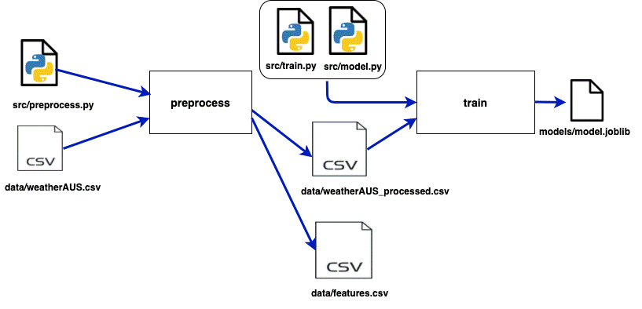

Después de configurar el almacenamiento remoto y configurar el inicio de un proyecto DVC para versionar datos y modelos, el siguiente paso es automatizar y estructurar flujos de trabajo mediante la construcción de un pipeline de experimentos. Un pipeline permite encadenar etapas del proceso (por ejemplo, preprocesamiento, entrenamiento y evaluación) de forma reproducible y trazable, facilitando el trabajo colaborativo y la experimentación sistemática.

Esta práctica está basada en el conjunto de datos previamente versionado con DVC (`data/raw/Dataset.csv`). Este archivo es la fuente de datos para entrenar el modelo de predicción. Consideremos que nuestro experimento tiene tres etapas principales:

- Preprocesamiento de datos (limpieza, extracción de características, y división de datos)
- Entrenamiento del modelo
- Evaluación del modelo

## 🎯 Objetivos

- Construir un pipeline de ML utilizando DVC.
- Declarar las dependencias y salidas de cada etapa del flujo de trabajo.
- Ejecutar y rastrear automáticamente los cambios en los datos o en el código que afecten el resultado del experimento.
- Comprender cómo DVC administra los archivos intermedios y el modelo final en cada etapa.

## 🛠️ Requisitos

Debes contar con los siguientes scripts organizados en tu proyecto:

- **preprocess.py**: realiza limpieza y extracción de características.
- **train.py**: entrena un modelo de clasificación.
- **evaluate.py**: evalúa el desempeño del modelo entrenado.

!!! warning "Advertencia:"
    Los pipelines propuestos a continuación están basados en la estructura del repositorio (creado en la práctica [Estructura del Proyecto](../entorno/p5.md) y especializado en las prácticas [Versionado del Código](../entrenamiento/p7.md), [Empaquetado y gestión de dependencias](../entrenamiento/p8.md) y [Buenas prácticas de codificación](../entrenamiento/p9.md)). Sin embargo, es posible crear otros scripts y crear pipelines específicos para las necesidades de su proyecto.


## Creación de pipelines
DVC construye un pipeline basado en tres componentes: Entradas (Inputs), Salidas (Outputs) y Comando (Command). Por ejemplo, para la etapa de preprocesamiento, estos serían los componentes:

- **Entradas**: archivo `dataset.csv` y el script `preprocess.py`
- **Salidas**: archivo `dataset_processed.csv`
- **Comando**: `python preprocess.py dataset.csv`

Para crear esta etapa de preprocesamiento, utilizamos el comando `dvc run` de la siguiente forma:

```bash
dvc run -n preprocess \
  -d ./src/preprocess_data.py -d data/dataset.csv \
  -o ./data/dataset_processed.csv \
  python3 ./src/preprocess_data.py ./data/dataset.csv
```

Aquí nombramos esta etapa como "preprocess" usando la opción `-n`. También definimos las entradas con la opción `-d` y las salidas con la opción `-o`. El comando que se ejecuta siempre va al final del comando `dvc run`, sin ninguna opción.

!!! warning "Consejo"
    Los archivos de salida se agregan al control de DVC cuando reproduces una etapa de DVC. Cuando finalices tu experimento, recuerda usar dvc push para versionar no solo los datos usados sino también los resultados generados durante el experimento.

La etapa de entrenamiento se crea de manera similar con:

```bash
dvc run -n train \
  -d ./src/train.py -d ./data/dataset_processed.csv -d ./src/model.py \
  -o ./models/model.joblib \
  python3 ./src/train.py ./data/dataset_processed.csv ./src/model.py
```

En este punto, es posible que hayas notado que se crearon dos archivos nuevos: `dvc.yaml` y `dvc.lock`.
El primero es responsable de guardar lo que se describió en cada comando `dvc run`. Por lo tanto, si deseas crear o modificar una etapa específica, es posible editar directamente el archivo `dvc.yaml`. El archivo actual se vería así:

```bash
stages:
  preprocess:
    cmd: python3 ./src/preprocess_data.py ./data/dataset.csv
    deps:
    - ./src/preprocess_data.py
    - data/dataset.csv
    outs:
    - ./data/dataset_processed.csv
    - ./data/features.csv
  train:
    cmd: python3 ./src/train.py ./data/dataset_processed.csv ./src/model.py 200
    deps:
    - ./data/dataset_processed.csv
    - ./src/model.py
    - ./src/train.py
    outs:
    - ./models/model.joblib
```

El segundo archivo creado es `dvc.lock`. Este también es un archivo YAML y su función es similar a los archivos `.dvc`. En su interior, podemos encontrar la ruta y un código hash para cada archivo de cada etapa, lo que permite a DVC hacer seguimiento de los cambios. Este seguimiento es importante porque ahora DVC puede saber cuándo una etapa debe ejecutarse de nuevo o no, basándose en si sus dependencias cambiaron.
El pipeline actual se ve así:



## Generar métricas
Finalmente, vamos a crear nuestra última etapa para poder evaluar nuestro modelo:

```bash
dvc run -n evaluate -d ./src/evaluate.py -d ./data/weatherAUS_processed.csv \
  -d ./src/model.py -d ./models/model.joblib \
  -M ./results/metrics.json \
  -o ./results/precision_recall_curve.png -o ./results/roc_curve.png \
  python3 ./src/evaluate.py ./data/weatherAUS_processed.csv ./src/model.py ./models/model.joblib
```

Es importante notar que en esta etapa usamos la opción `-M` en lugar de la opción `-o`. Esto es relevante porque ahora podemos almacenar las métricas generadas por cada experimento.
Si ejecutamos el comando:

```bash
dvc metrics show
```

podremos ver qué tan bueno fue el experimento, ya que este comando muestra las métricas guardadas en el archivo `metrics.json`.

```bash
$ dvc metrics show
Path                  accuracy    f1       precision    recall        
results/metrics.json  0.84973     0.90747  0.8719       0.94607
```
